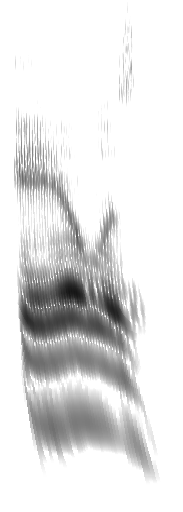

# Cochleagram

Sound, seen the way the ear resolves it.

A cochleagram is a picture of sound over time, like a spectrogram — but drawn
by a model of the inner ear rather than by a Fourier transform. Six hundred
filters, sixty to the octave, from 20 Hz to 20 kHz, at the bandwidths human
hearing actually uses.

An FFT-based spectrogram picks one trade-off between time and frequency and
applies it everywhere: a long window separates low harmonics and smears every
attack, a short one does the reverse. The ear resolves frequency finely at the
bottom and time finely at the top, so both are visible in one picture.



*The reconstruction. `screenshots/2006_scaleis.PNG` is the original on the
same material, for comparison.*

## What this is

A reconstruction of a display designed by Lloyd Watts at Audience, Inc. around
2006. Stephen Malinowski worked with it there as a DSP
engineer, and has rebuilt it from memory and from first principles. **No code
was carried over.** Where memory ran out — which was most of the way down —
the answer was worked out again from the published literature and checked
against what the original looked like on the same material.

The core patent has expired. `IP-landscape.md` sets out what that does and
does not mean.

## Layout

| | |
|---|---|
| `prototype/` | Python. Defines correctness — the filter design, the coefficient baking, and the reference implementations everything in the app is checked against. See `prototype/README.md`. |
| `xcode/` | The real-time macOS app: a C++ engine behind a thin C interface, an AppKit front end, and baked coefficients for nine tuning sharpnesses. |
| `web/` | The same engine compiled to WebAssembly, and a page that runs it. See `web/README.md`. |
| `OPEN-QUESTIONS.md` | What is still not understood. |

## Getting it

It runs in a browser at
[musanim.com/Cochleagram](https://www.musanim.com/Cochleagram/), which needs
nothing installed. The same page has a signed, notarized Mac build.

The browser version is not a reimplementation: it is `cochlea.cpp` compiled to
WebAssembly through the same C interface the Mac app uses, and it produces
numbers identical to the native build to six decimal places. Everything above
except Coherence is in both.

To build it yourself:

```
cd xcode/Cochleagram
./make_app.sh
```

That produces `Cochleagram.app`. The script bakes the coefficient files first
if they are missing, which needs Python with numpy and scipy; SwiftPM
otherwise produces a bare executable, and macOS will not grant microphone
access to one, so the script wraps it in a bundle with an `Info.plist`. There
is also an Xcode project, which uses a different resource layout — see the
comments in `make_app.sh`.

Targets macOS 12, Swift 5.7.

## Some of what is in it

- **A middle-ear transfer function** ahead of the cascade. Without it the
  filterbank has DC gain, and a rectangular pulse painted the low taps solid
  instead of drawing the two clicks it should.
- **Sine-fit peak interpolation.** The taps are resonators, so
  `y(1) + y(−1) = 2·cos(ω)·y(0)`; fitting the sine gives peak times far below
  the sample period, which the timing measurements need at 16 kHz.
- **A close-up region** giving the last fraction of a second its own, finer
  time scale on the right of the picture, flowing into the main image.
- **Coherence**, an experimental display that colours by the phase
  relationship between neighbouring taps rather than by loudness —
  red for transient, green for tone, blue for noise.
- **On-picture measurement**: a crosshair reading frequency off any row, and,
  on a frozen picture, a pair of lines with the duration between them.

## Credit and licence

Idea and direction: Stephen Malinowski. Implementation: Claude (Anthropic).
Reconstruction of a display designed by Lloyd Watts.

MIT — see `LICENSE`. Take it and use it.
